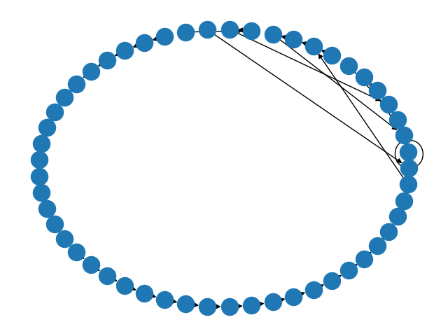

This simple program can explore the graph of odd numbers generated by the Collatz process (That is: n-> odd part of 3n+1). See for example this graph of Collatz path generated by paths that have odd numbers <20 as origin points.

The "images" folder also has the graph for odd numbers <1000, but really, you probably don't want to see that.
